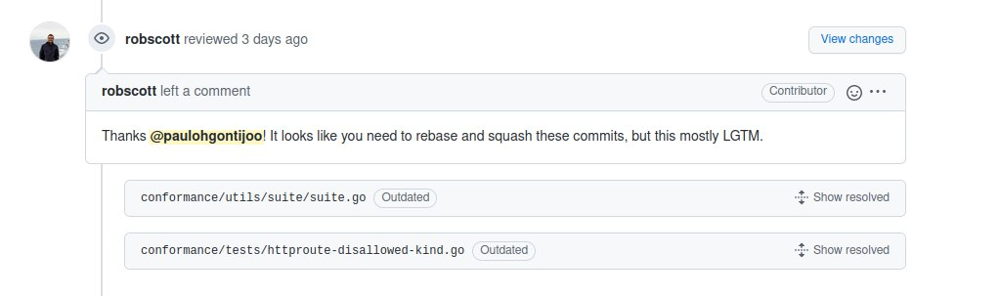
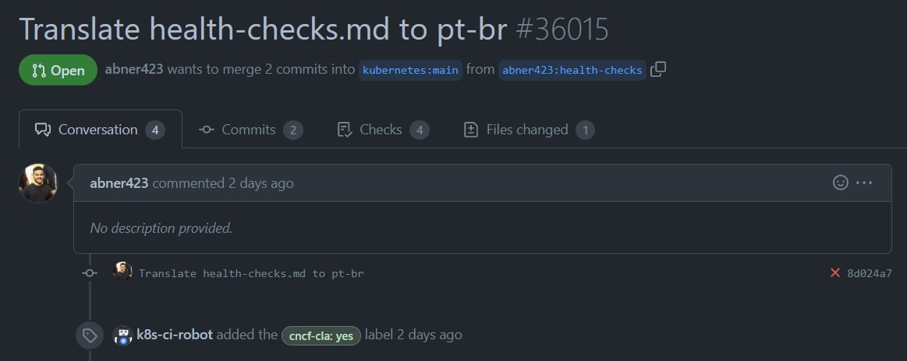
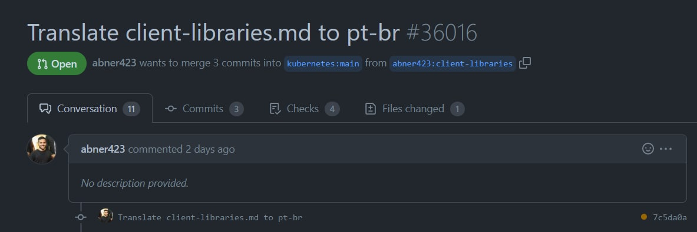
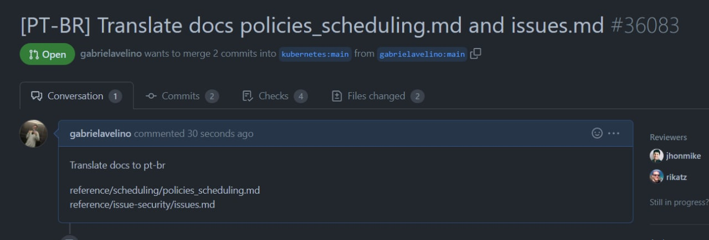
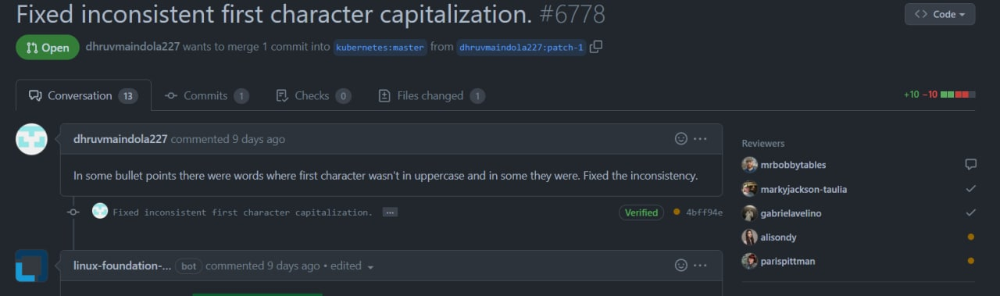

# SPRINT 4 - Kubernetes

## Planejamento

Para a Sprint 4, o nosso grupo continuo com o pareamento, em busca de finalizar as issues realizadas nas sprints passadas e conseguirem ter os seus PRs aprovados. 

|Duplas|
|:-:|
| Geraldo Victor e Paulo Gontijo|
| Abner Filipe e Gabriel Avelino|
| Natanael Filho e Lorrany Oliveira|
| Daniel Alves e Gustave Persijin|

<h6 align = "center">Tabela 1: Duplas</h6>

## Objetivos

O grupo decidiu ir atrás de realizar cada tipo de atividade e contribuição dentro da comunidade do Kubernetes, completando as atividades da Sprint 3. Algumas das atividades foram:
 
- Revisar e finalizar traduções.
    
- Revisão de PRs.

- Finalizar Issues em aberto.

## Trabalhos realizados

## <a>Issue #1273</a>

 A issue da sprint passada <a>#1273 </a> da organização principal do <a>Kubernetes</a>. Link da issue: 
 <a>https://github.com/kubernetes-sigs/gateway-api/issues/1273 </a>

A issue foi finalizada e recebeu a tag <a>LGTM (Looks good to me)</a>  do mantenedor, tal tag é pré-requisito para que o PR seja merjado.

<h6 align = "center">Imagem 1 - Issue escolhida pelo grupo</h6>

## Tradução de documento

Além da issue acima foi realizado uma tradução de documentação para PT-BR, seguindo as regras de contribuição, onde tem que dar o assign no excell, escolhendo a documentação desejada para tradução.

<h6 align = "center">Imagem 2 - PR da documentação </h6>

Documento que traduz os health-checks do inglês para o pt-br.

<h6 align = "center">Imagem 3 - PR da documentação </h6>

Documento que traduz o client-libraries do inglês para o pt-br.

<h6 align = "center">Imagem 4 - PR da documentação </h6>

Documento que traduz as políticas do escalonador e como abrir issues para o kubernetes.

## <a>Revisão de PR </a>

Outra abordagem tomada pelo grupo, foi a de revisar pull-request para o maior entendimento da linguagem GO, comentando nos PRs para ter uma interação maior com a comunidade e tirar dúvidas sobre o código.

O primeiro PR revisado foi de uma tradução de documentação, onde o contribuidor queria uma revisão mais urgente da documentação e era um novato na comunidade. Link do PR: <a>https://github.com/kubernetes/community/pull/6778</a>

<h6 align = "center">Imagem 5 - PR revisado pela dupla</h6>

## Versionamento

|Data|Versão|Descrição|Autor|
|:--:|:--:|:--:|:--:|
|17/08/22|1.0|Criaçao do documento|Gabriel Avelino|
|18/08/22|1.1|Ajustes de formatação e criação de legendas para as imagens| Gabriel Avelino |
|18/08/22|1.2|Ajustes de formatação e criação de legendas para as imagens| Gabriel Avelino, Geraldo Victor, Paulo Gontijo, Lorrany Oliveira, Natanael Filho |