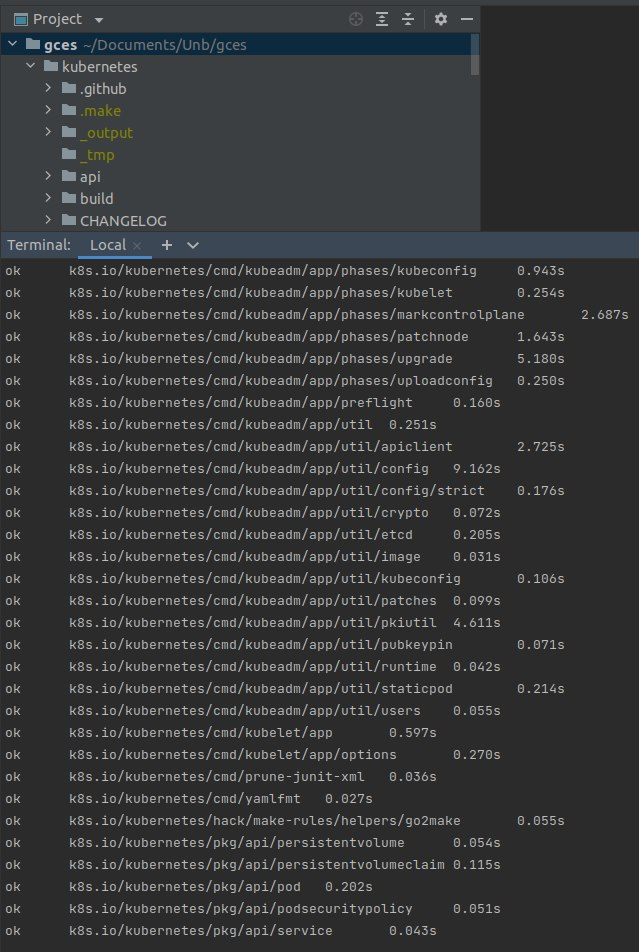

# SPRINT 1 - Kubernetes

## Planejamento

Com o começo da Sprint, o grupo se reuniu 5 vezes para discutir sobre o projeto e a entrega da primeira Sprint. As reuniões foram mapeadas da seguinte forma:
    <ul>
        <li>Primeira reunião: Ocorreu durante a aula, onde ocorreu o primeiro encontro de grupos. Objetivos: conhecer os membros do grupo e dar início a discussão do projeto</li>
        <li>Segunda reunião: Ocorreu online, através do Google Meet. Objetivos: conhecer mais o repositório do Kubernetes, verificar se os membros entraram no Slack da comunidade e se cadastraram no CNCL</li>
        <li>Terceira reunião: Ocorre online, através do Google Meet. Objetivos: Fazer o primeiro contato com o maintenedor do grupo, onde ele explicou mais sobre o Kubernetes e como contribuir para essa comunidade.</li>
        <li>Quarta reunião: Ocorreu online, através do Google Meet. Objetivos: Os membros se reuniram para configurar o ambiente do Kubernetes e sanar as dúvidas dos demais colegas</li>
    </ul>

## Objetivos realizados

Para a entrega da primeira sprint o grupo se organizou para cada um estudar e compreender como funciona, o que é a comunidade e a aplicação do Kubernetes. Após essa pesquisa, para entrar na comunidade do kubernetes é preciso concluir alguns tópicos:

    <ul>
        <li>Primeiro ler a documentação de contribuição de cada subgrupo do kubernetes. O kubernetes é uma comunidade muito grande por isso cada subgrupo tem a sua maneira de como contribuir para o repositório.</li>
        <li>Depois, entrar nos subcanais do Slack, onde cada sub-comunidade possui um subcanal onde pode-se tirar dúvidas sobre aquele respectivo subgrupo.</li>
        <li>Tentar baixar o ambiente, cada repositório possui uma lista de como instalar o ambiente na sua máquina, e podendo variar os pacotes que precisam ser baixados por cada comunidade.</li>
    </ul>

## Ambiente de trabalho

Para o funcionamento do ambiente, conseguimos com apenas alguns passos descritos logo em seguida. Os passos abaixos partem do princípio que o repositório do kubernetes que pode ser encontrado no link https://github.com/kubernetes/kubernetes já está clonado, que já existe um terminal rodando dentro dessa pasta, que o GO e o docker já estão instalados corretamente na máquina, e esteja rodando em um ambiente linux.

    Passo 1 - make quick-release
    Passo 2 - sudo usermod -aG docker $USER
    Passo 3 - newgrp docker
    Passo 4 - make quick-release

## Resultado

## Pendências Futuras

Para a entrega das próximas Sprints, o grupo vai continuar tentando instalar outros subgrupos do Kubernetes onde se sentem mais a vontade para contribuir, com a ajuda do meta coach e do Slack para tirar dúvidas em tempo real. Algumas apendências:

    - Tentar baixar o ambiente de documentação
    - Tentar baixar o repositório em que o maintenedor em seu semestre, o ingress-nginx
    - Procurar issues no nível de conhecimento do grupo
    - Aprender mais a fundo a linguagem Go
    - Criar contatos no Slack para tirar as dúvidas

