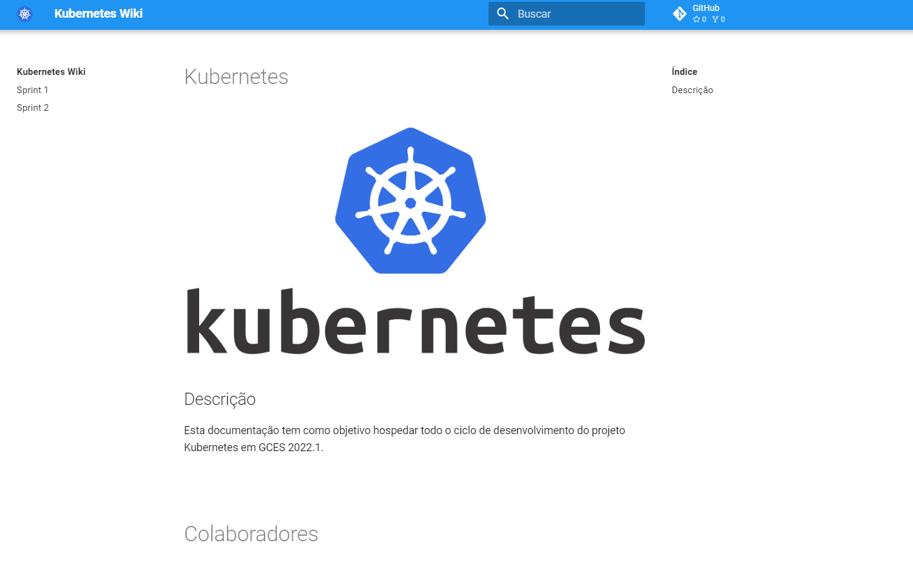
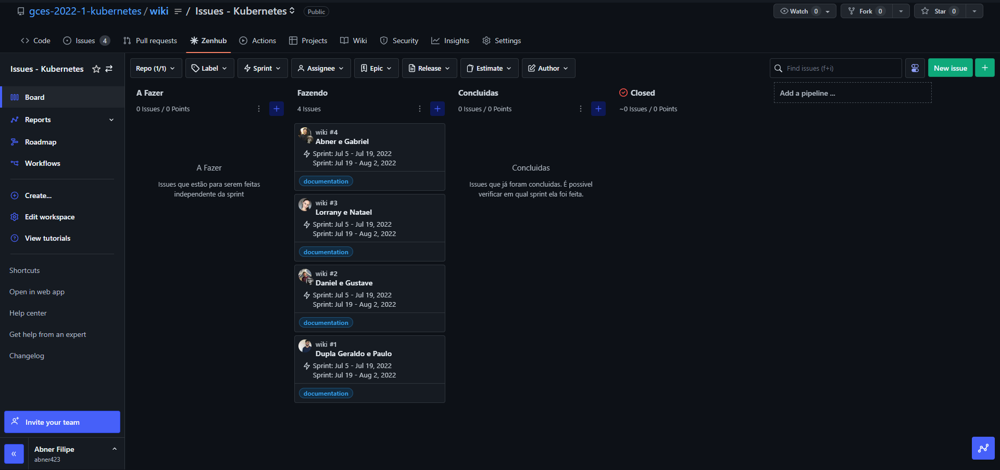
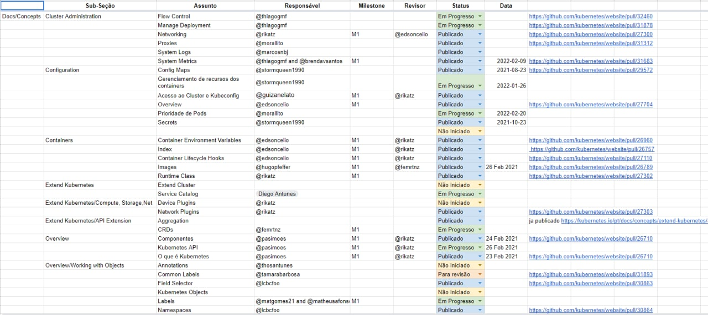
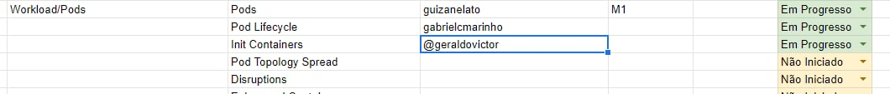
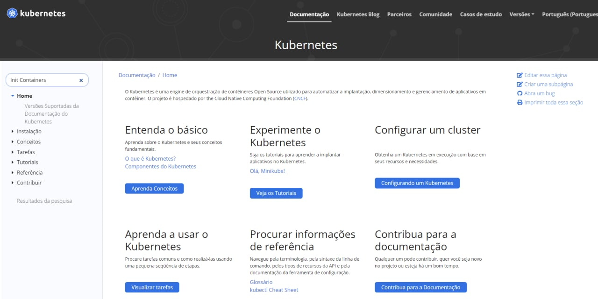
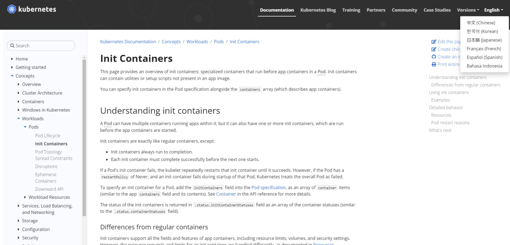
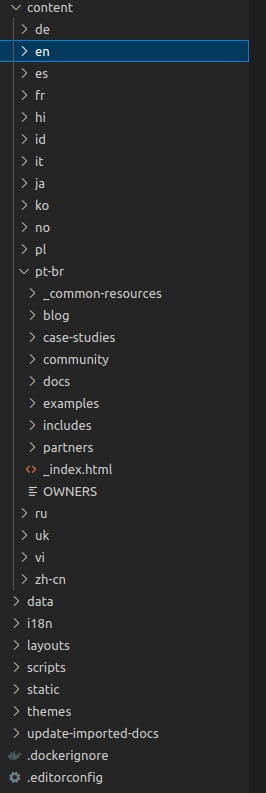
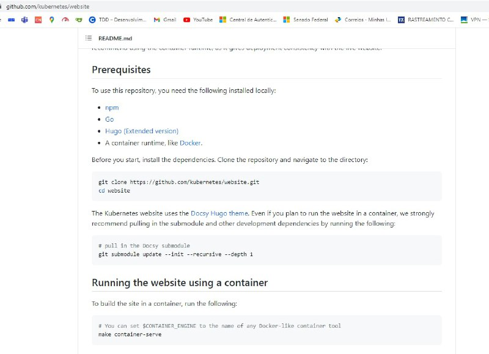
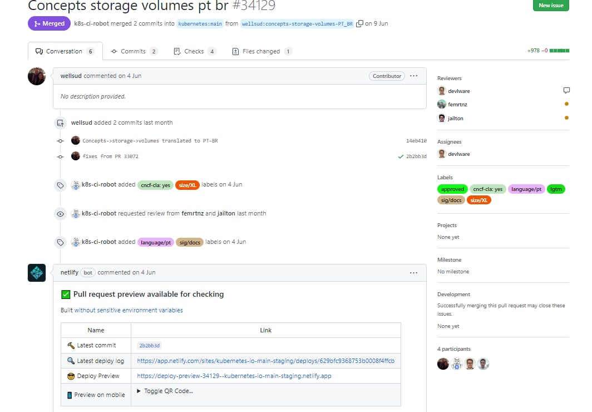
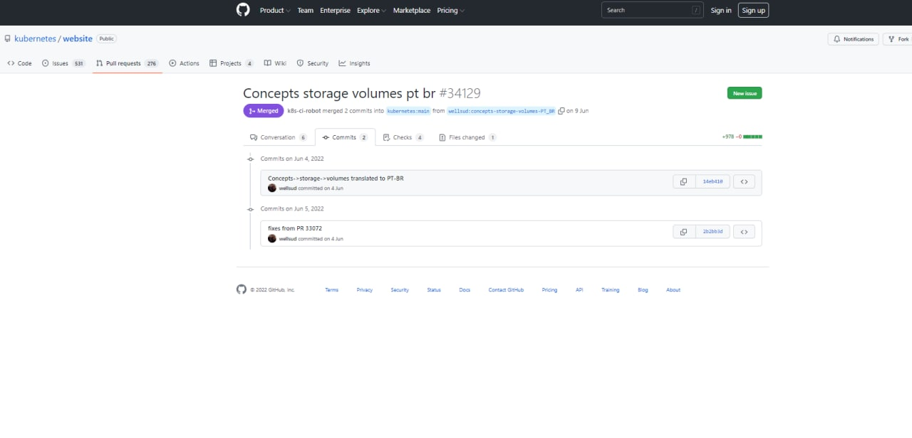

# SPRINT 2 - Kubernetes
## Planejamento
Para a sprint 2, baseado nos feedbacks da sprint 1 e possíveis melhorias que poderíamos fazer, optamos por subdividir o grupo em duplas para que ficasse de mais fácil gestão e dessa forma também, termos um bom fluxo de conhecimento entre os integrantes, deixando todos no mesmo nível.

Tendo em vista essa forma de organização, também optamos pela utilização do zenhub, para termos melhor as issues atuadas pelas duplas e o status delas.

## Objetivos realizados
Efetuamos a criação da wiki que servirá para hospedar todo o nosso ciclo de desenvolvimento do projeto kubernetes em GCES 2022.1

Configuramos o ZenHub no projeto, e colocamos o nome de cada issue, o nome dos integrantes que atuaram em dupla para fácil identificação, sendo responsabilidade de cada dupla alterar a descrição da issue e colocar os dados que julguem necessários para o bom entendimento da sua atuação naquela sprint. Todas as issues podem ser encontradas no nosso [repositório](https://github.com/gces-2022-1-kubernetes/wiki)

## Exemplo do fluxo para tradução de uma documentação
Para achar um conteúdo que deseja traduzir basta ir até a [planilha](https://docs.google.com/spreadsheets/d/1HiaVFJ7nRZo1MPNNYyq1u-L_N9xrJvzuUzkZ3GuJGNU/edit#gid=2132616444), e buscar por texto que não tenham nenhuma pessoa atribuída

Abaixo fica exemplificado como um de nossos integrantes fez.

Busque pelo conceito na página da [documentação](https://kubernetes.io/pt-br/docs/home/)

Aqui podemos ver o termo que nosso integrante se responsabilizou pela tradução

Procure pelo texto em questão no editor de texto de preferência, veja a estrutura hierárquica na página "en" (que seria a página em inglês), e adicione o arquivo respeitando a mesma hierarquia porém na pasta "pt-br"

Para rodar o ambiente de documentação basta seguir esses passos descritos no readme do repositório que fica localizado toda configuração para subir a documentação do projeto, e pode ser encontrado [aqui](https://github.com/kubernetes/website)

Após traduzido o documento abra um pr

Aqui podemos ver um pr merjado e tomar uma base de como são feitos os commits de documentação para que os mantenedores aceitem o pr

|Data|Versão|Descrição|Autor|
|:--:|:--:|:--:|:--:|
|19/07/22|1.0|Criação da página e formatação da Wiki|Abner Filipe e Paulo Gontijo|