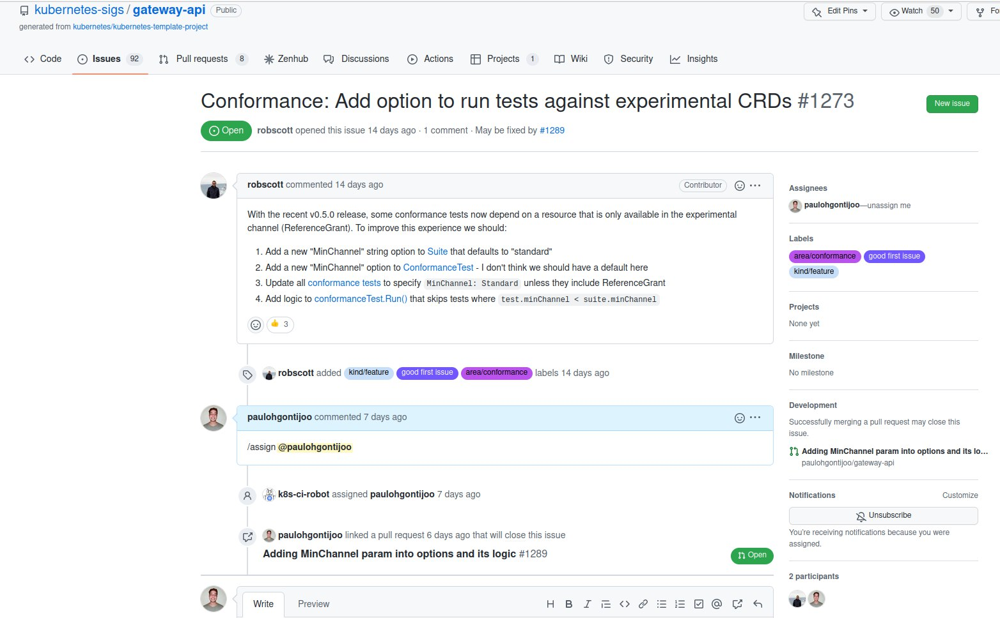
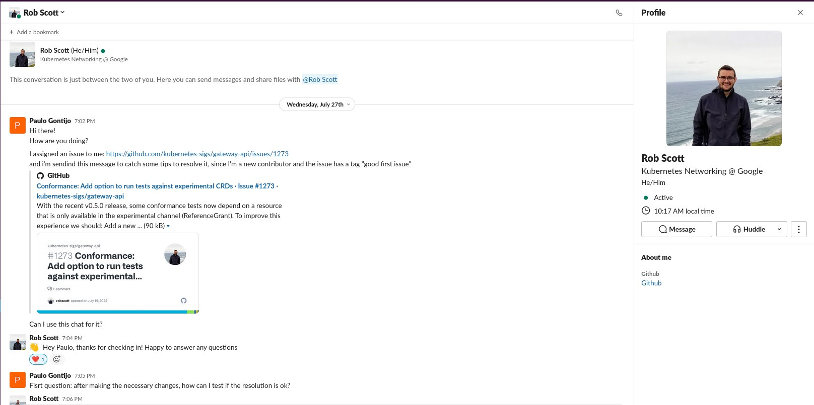
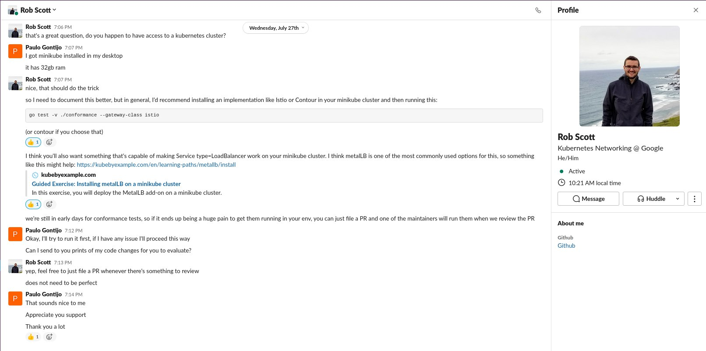
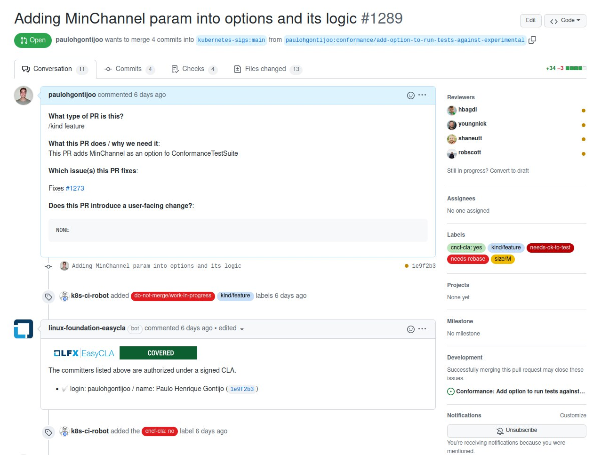
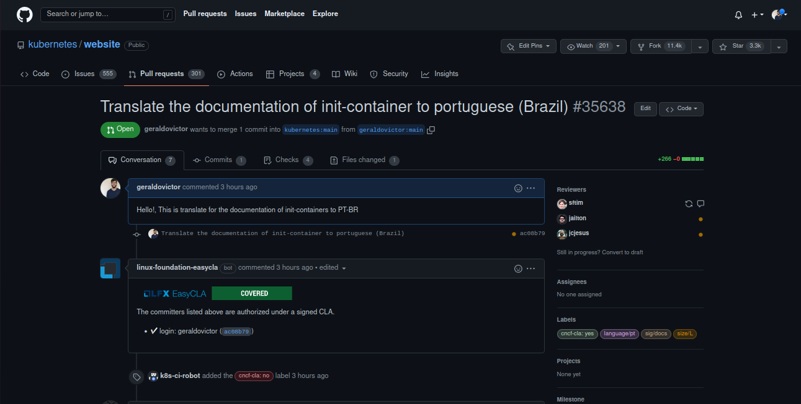
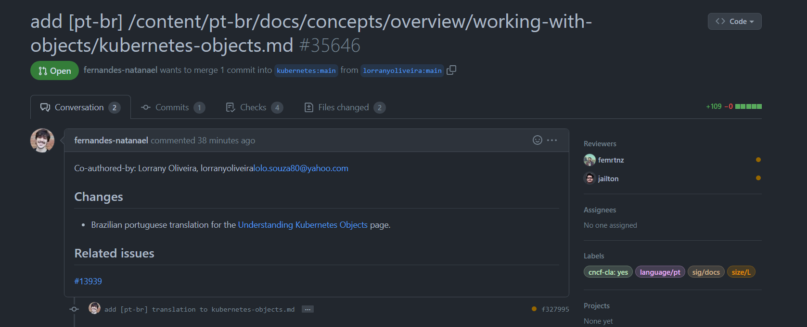
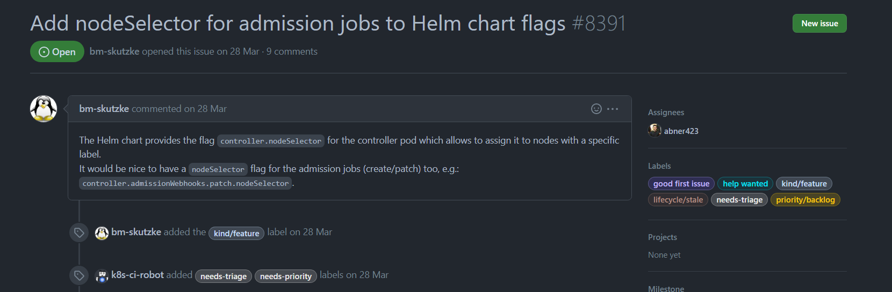
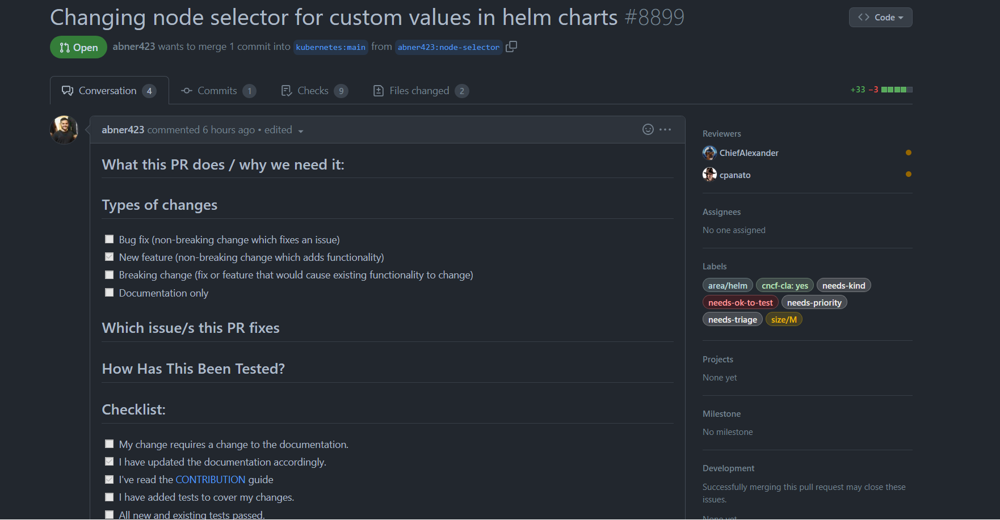
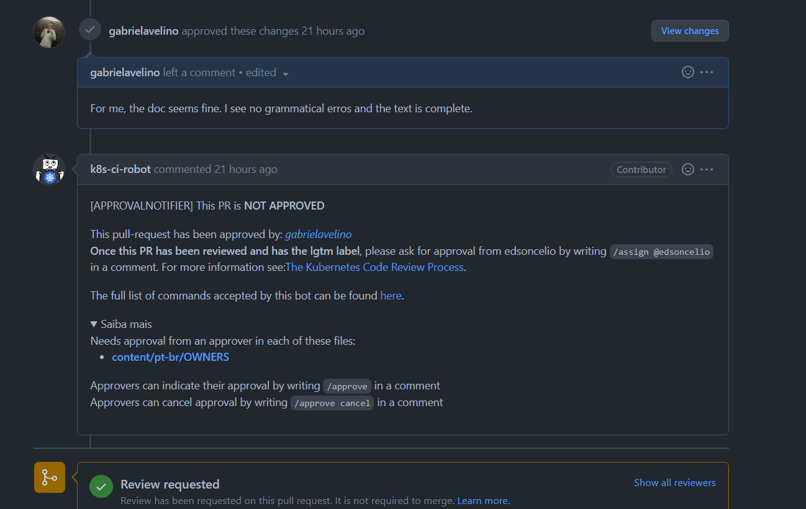
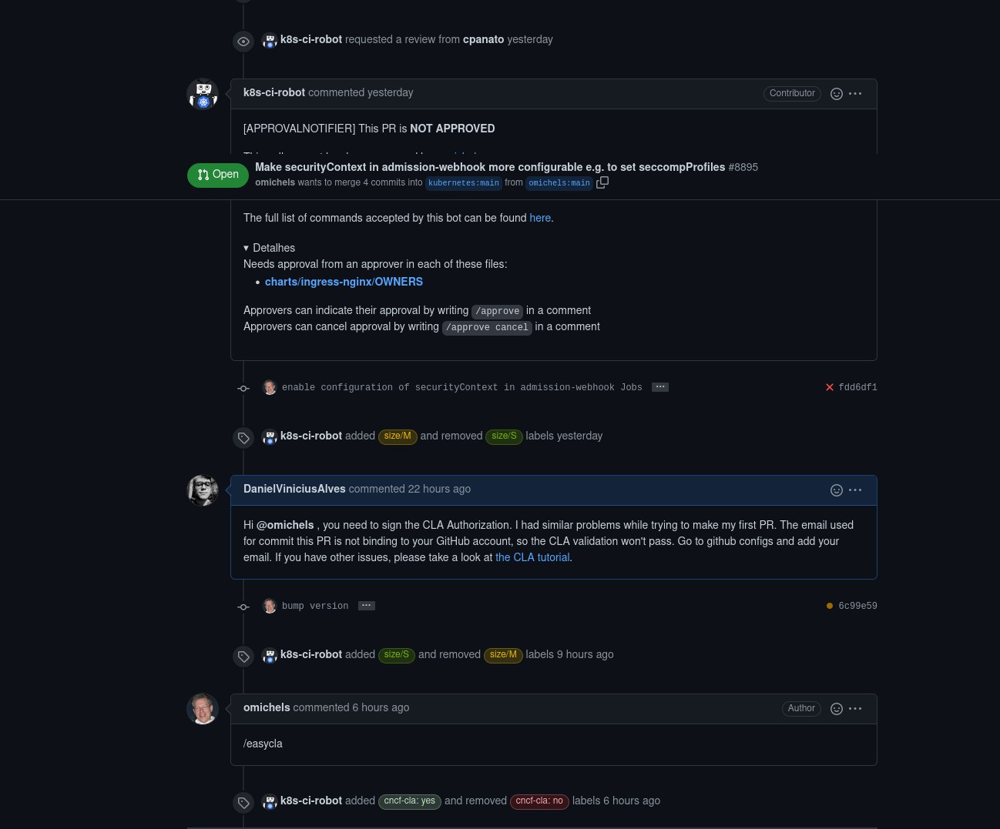

# SPRINT 3 - Kubernetes

## Planejamento

Para a Sprint 3 o grupo resolveu iniciar a tocar no repositório mais a fundo, já que o estudo na linguagem Go vem acontecendo desde as primeiras Sprints. Com a divisão em <a>pair programming</a>, cada dupla resolveu pegar uma issue para resolver, a divisão das duplas foi seguido desde a primeira Sprint. Com a ajuda dos conteúdos estudados em Go e do canal de ajuda fornecido pelo próprio <a>Kubernetes</a> conhecido como <a>Slack</a>.

|Duplas|
|:-:|
| Geraldo Victor e Paulo Gontijo|
| Abner Filipe e Gabriel Avelino|
| Natanael Filho e Lorrany Oliveira|
| Daniel Alves e Gustave Persijin|

<h6 align = "center">Tabela 1: Duplas</h6>

## Objetivos

Com cada dupla tendo estudado o conteúdo, cada dupla foi atrás de um grupo ou subgrupo dentro da organização do <a>Kubernetes</a> para achar um repositório que tenha mais afinidade para contribuir.
 
 - Primeiro ler a documentação de contribuição de cada subgrupo do kubernetes. O kubernetes é uma comunidade muito grande por isso cada subgrupo tem a sua maneira de como contribuir para o repositório.
    
- Ver as issues propostas pelo grupo/subgrupo, para facilitar foi pesquisado pela label <a>good-first-issue</a>.

- Seguir as regras da comunidade e dar <a>/assign</a> para demonstrar que tem interesse na issue e está trabalhando nela.

- Abrir um PR para ver o andamento da issue e ter a revisão dos mantenedores.

## Trabalhos realizados

## <a>Issue #1273</a>

 A primeira Issue escolhida pelo grupo foi a <a>#1273 </a> da organização principal do <a>Kubernetes</a>. Link da issue: 
 <a>https://github.com/kubernetes-sigs/gateway-api/issues/1273 </a>

<h6 align = "center">Imagem 1 - Issue escolhida pelo grupo</h6>

Para resolver essa issue a dupla responsável foi atrás de um contribuidor ativo da comunidade para poder ajudar a ter esse primeiro contato.

<h6 align = "center">Imagem 2 - Conversa com o contribuidor</h6>

<h6 align = "center">Imagem 3 - Conversa com o contribuidor</h6>

Com isso, a dupla começou a trabalhar na issue, abrindo um PR para ser revisado.

<h6 align = "center">Imagem 4 - PR realizado pela dupla</h6>

## Tradução de documento

Além da issue acima foi realizado uma tradução de documentação para PT-BR, seguindo as regras de contribuição, onde tem que dar o assign no excell, escolhendo a documentação desejada para tradução.

<h6 align = "center">Imagem 5 - PR da documentação </h6>

O documento escolhido para ser traduzido foi do init-Container para PT-BR.

A outra tradução de documentação foi do <a>Kubernetes-objects</a>, onde a dupla seguiu os passos para dar assign para realizar a documentação, assim, abrindo um PR para o documento ser revisado.

<h6 align = "center">Imagem 5 - PR da documentação  </h6>

## <a>Issue #8391</a>

Outra issue escolhida foi a do Node-selector, uma issue da organização dos subgrupos <a>SIG-Kubernetes</a>, do repositório recomendado pelo <a>Metacoach</a> o ingress-nginx. A issue pode ser acessada por: <a>https://github.com/kubernetes/ingress-nginx/issues/8391</a>

<h6 align = "center">Imagem 6 - Issue escolhida pela dupla </h6>

Após ter dado assign na issue, a dupla começou a trabalhar para conseguir completar a issue, ao final abriu um PR para poder ser revisado pelos outros contribuidores.

<h6 align = "center">Imagem 7 - PR realizado pela dupla</h6>

## <a>Revisão de PR </a>

Outra abordagem tomada pelo grupo, foi a de revisar pull-request para o maior entendimento da linguagem GO, comentando nos PRs para ter uma interação maior com a comunidade e tirar dúvidas sobre o código.

O primeiro PR revisado foi de uma tradução de documentação, onde o contribuidor queria uma revisão mais urgente da documentação. Link do PR: <a>https://github.com/kubernetes/website/pull/35243</a>

<h6 align = "center">Imagem 8 - PR revisado pela dupla</h6>

O Segundo PR revisado foi para ajudar um novo contribuidor, que não conhecia as regras da comunidade, não tendo se inscrevido no CLA, sendo assim, não sendo aprovado o PR.

<h6 align = "center">Imagem 9 - PR em que a dupla ajudou o contribuidor</h6>

## Pendências Futuras

Para a entrega das próximas Sprints, o grupo vai continuar tentando instalar outros subgrupos do Kubernetes onde se sentem mais a vontade para contribuir, com a ajuda do maintenedor e do Slack para tirar dúvidas em tempo real. Algumas apendências:

* Aprofundar mais na linguagem GO
* Procurar issues no nível de conhecimento mais aprofundado

## Versionamento

|Data|Versão|Descrição|Autor|
|:--:|:--:|:--:|:--:|
|01/08/22|1.0|Criaçao do documento|Gabriel Avelino|
|02/08/22|1.1|Ajustes de formatação e criação de legendas para as imagens| Gabriel Avelino |
|02/08/22|1.2|Ajustes de formatação e criação de legendas para as imagens| Gabriel Avelino, Geraldo Victor, Paulo Gontijo, Lorrany Oliveira, Natanael Filho |